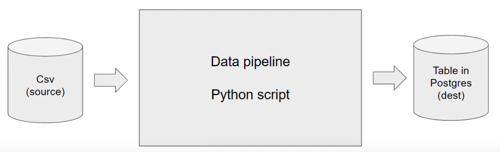

>[Back to Index](README.md)

>Next: [Data Ingestion](2_data_ingestion.md)

### Table of contents

- [Introduction to Data Engineering](#introduction-to-data-engineering)
  - [Architecture](#architecture)
  - [Data pipelines](#data-pipelines)
- [Docker and Postgres](#docker-and-postgres)
  - [Docker basic concepts](#docker-basic-concepts)
  - [Creating a custom pipeline with Docker](#creating-a-custom-pipeline-with-docker)
  - [Running Postgres in a container](#running-postgres-in-a-container)
  - [Ingesting data to Postgres with Python](#ingesting-data-to-postgres-with-python)
  - [Connecting pgAdmin and Postgres with Docker networking](#connecting-pgadmin-and-postgres-with-docker-networking)
  - [Using the ingestion script with Docker](#using-the-ingestion-script-with-docker)
    - [Exporting and testing the script](#exporting-and-testing-the-script)
    - [Dockerizing the script](#dockerizing-the-script)
  - [Running Postgres and pgAdmin with Docker-compose](#running-postgres-and-pgadmin-with-docker-compose)
  - [SQL refresher](#sql-refresher)
- [Terraform and Google Cloud Platform](#terraform-and-google-cloud-platform)
  - [GCP initial setup](#gcp-initial-setup)
  - [GCP setup for access](#gcp-setup-for-access)
  - [Terraform basics](#terraform-basics)
  - [Creating GCP infrastructure with Terraform](#creating-gcp-infrastructure-with-terraform)
- [Extra content](#extra-content)
  - [Setting up a development environment in a Google Cloud VM](#setting-up-a-development-environment-in-a-google-cloud-vm)
  - [Port mapping and networks in Docker](#port-mapping-and-networks-in-docker)

# Introduction to Data Engineering
***Data Engineering*** is the design and development of systems for collecting, storing and analyzing data at scale.

## Architecture

During the course we will replicate the following architecture:


* [New York's Taxi and Limousine Corporation's Trip Records Dataset](https://github.com/DataTalksClub/data-engineering-zoomcamp/blob/main/dataset.md): the dataset we will use during the course.
* [Spark](https://spark.apache.org/): analytics engine for large-scale data processing (distributed processing).
* [Google BigQuery](https://cloud.google.com/products/bigquery/): serverless _data warehouse_ (central repository of integrated data from one or more disparate sources).
* [Airflow](https://airflow.apache.org/): workflow management platform for data engineering pipelines. In other words, a pipeline orchestration tool.
* [Kafka](https://kafka.apache.org/): unified, high-throughput,low-latency platform for handling real-time data feeds (streaming).


# Introduction to Data Engineering
***Data Engineering*** is the design and development of systems for collecting, storing and analyzing data at scale.

## Architecture

During the course we will replicate the following architecture:


* [New York's Taxi and Limousine Corporation's Trip Records Dataset](https://github.com/DataTalksClub/data-engineering-zoomcamp/blob/main/dataset.md): the dataset we will use during the course.
* [Spark](https://spark.apache.org/): analytics engine for large-scale data processing (distributed processing).
* [Google BigQuery](https://cloud.google.com/products/bigquery/): serverless _data warehouse_ (central repository of integrated data from one or more disparate sources).
* [Airflow](https://airflow.apache.org/): workflow management platform for data engineering pipelines. In other words, a pipeline orchestration tool.
* [Kafka](https://kafka.apache.org/): unified, high-throughput,low-latency platform for handling real-time data feeds (streaming).

## Data pipelines

A **data pipeline** is a service that receives data as input and outputs more data. For example, reading a CSV file, transforming the data somehow and storing it as a table in a PostgreSQL database.



_[Back to the top](#table-of-contents)_

# Docker and Postgres

## Docker basic concepts

_([Video source](https://www.youtube.com/watch?v=EYNwNlOrpr0&list=PL3MmuxUbc_hJed7dXYoJw8DoCuVHhGEQb&index=3))_

**Docker** is a _containerization software_ that allows us to isolate software in a similar way to virtual machines but in a much leaner way.

A **Docker image** is a _snapshot_ of a container that we can define to run our software, or in this case our data pipelines. By exporting our Docker images to Cloud providers such as Amazon Web Services or Google Cloud Platform we can run our containers there.

Docker provides the following advantages:
* Reproducibility
* Local experimentation
* Integration tests (CI/CD)
* Running pipelines on the cloud (AWS Batch, Kubernetes jobs)
* Spark (analytics engine for large-scale data processing)
* Serverless (AWS Lambda, Google functions)

Docker containers are ***stateless***: any changes done inside a container will **NOT** be saved when the container is killed and started again. This is an advantage because it allows us to restore any container to its initial state in a reproducible manner, but you will have to store data elsewhere if you need to do so; a common way to do so is with _volumes_.

>Note: you can learn more about Docker and how to set it up on a Mac [in this link](https://github.com/ziritrion/ml-zoomcamp/blob/11_kserve/notes/05b_virtenvs.md#docker). You may also be interested in a [Docker reference cheatsheet](https://gist.github.com/ziritrion/1842c8a4c4851602a8733bba19ab6050#docker).

## Creating a custom pipeline with Docker

_([Video source](https://www.youtube.com/watch?v=EYNwNlOrpr0&list=PL3MmuxUbc_hJed7dXYoJw8DoCuVHhGEQb&index=3))_

Let's create an example pipeline. We will create a dummy `pipeline.py` Python script that receives an argument and prints it.

```python
import sys
import pandas # we don't need this but it's useful for the example

# print arguments
print(sys.argv)

# argument 0 is the name os the file
# argumment 1 contains the actual first argument we care about
day = sys.argv[1]

# cool pandas stuff goes here

# print a sentence with the argument
print(f'job finished successfully for day = {day}')
```

We can run this script with `python pipeline.py <some_number>` and it should print 2 lines:
* `['pipeline.py', '<some_number>']`
* `job finished successfully for day = <some_number>`

Let's containerize it by creating a Docker image. Create the folllowing `Dockerfile` file:

```dockerfile
# base Docker image that we will build on
FROM python:3.9.1

# set up our image by installing prerequisites; pandas in this case
RUN pip install pandas

# set up the working directory inside the container
WORKDIR /app
# copy the script to the container. 1st name is source file, 2nd is destination
COPY pipeline.py pipeline.py

# define what to do first when the container runs
# in this example, we will just run the script
ENTRYPOINT ["python", "pipeline.py"]
```